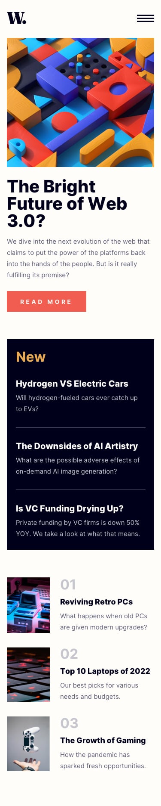

# News homepage   

Esta página de inicio de noticias es una excelente oportunidad para practicar habilidades en CSS Grid. Cabe destacar que he desarrollado este sitio web utilizando React y el framework Tailwind, lo que me permite aplicar mis conocimientos en diseño web y maquetación con tecnologías de vanguardia.

## Link

- [News homepage](https://newhomepages.netlify.app/)

### Desktop

    

### Mobile

    

## Documentación usada

  
  

##

## Authors

- [@Cristian Arias](https://www.github.com/Cristian0813)

## Agradecimientos

 - [Frontend Mentor](https://www.frontendmentor.io/)

## License

[MIT](https://github.com/Cristian0813/News-homepage/blob/main/LICENSE)

